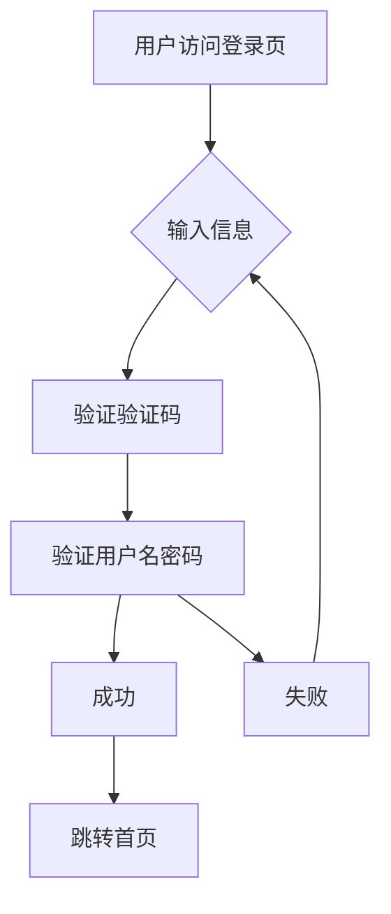

# 银行管理系统使用说明  
**版本：v1.0**  
**编写日期：2025年8月**  
**适用对象：系统管理员、银行客户、开发维护人员**

---

## 目录

1. 系统概述  
2. 运行环境要求  
3. 安装与部署  
4. 功能模块介绍  
5. 使用步骤详解  
6. 常见问题与解决方法  
7. 系统结构说明  
8. 数据库设计  
9. 附录  

---

## 1. 系统概述

本系统是一个基于Django框架开发的银行管理系统，具备用户管理、账户查询、交易记录管理、信用卡服务、财富管理、生活服务等功能模块。系统支持多用户角色（普通用户、管理员），具备良好的用户界面和交互体验。

---

## 2. 运行环境要求

| 环境项     | 要求                    |
| ---------- | ----------------------- |
| 操作系统   | Windows / Linux / macOS |
| Python版本 | 3.8+                    |
| Django版本 | 4.2+                    |
| 数据库     | SQLite / MySQL          |
| 浏览器     | Chrome / Firefox / Edge |

---

## 3. 安装与部署

### 3.1 克隆代码库

```bash
git clone <repository-url>
cd p1
```

### 3.2 安装依赖

```bash
pip install -r requirements.txt
```

### 3.3 数据库迁移

```bash
python manage.py makemigrations
python manage.py migrate
```

### 3.4 启动服务

```bash
python manage.py runserver
```

访问：http://127.0.0.1:8000

以下是启动示例：


---

## 4. 功能模块介绍

### 4.1 用户登录与注册
- 支持用户登录、注册、密码管理

- 验证码功能增强安全性

- 页面背景采用动态粒子效果，增强美观性

  

### 4.2 首页展示
- 轮播视频展示防诈骗宣传

- 服务入口快捷访问

- 新闻咨询了解当前最新动态

  

  

  

### 4.3 信用卡服务

- 信用卡推荐

- 优惠活动展示

- 用卡安全指南

  

  

  

  

### 4.4 财富管理

- 理财产品展示

- 财经资讯

- 投资建议

  

  

  

### 4.5 生活服务
- 金融服务分类

- 热门活动

- 理财资讯

  

  

### 4.6 我的账户
- 账户信息查看

- 余额显示

- 密码保护功能

  

### 4.7 超级管理员后台
- 用户信息管理

- 增删改查功能

- 分页展示

  

  


---

## 5. 常见问题与解决方法

### Q1：验证码不显示怎么办？
A：检查`captcha.py`是否正确配置，确保Pillow库已安装。

### Q2：数据库连接失败？
A：检查`settings.py`中数据库配置，确保数据库服务已启动。

### Q3：静态资源加载失败？
A：运行`python manage.py collectstatic`收集静态文件。

---

## 6. 系统结构说明

### 6.1 项目结构


### 6.2 流程图：用户登录流程



---

## 8. 数据库设计

### 8.1 用户表（UserMsg）

| 字段名   | 类型         | 说明       |
| -------- | ------------ | ---------- |
| id       | AutoField    | 主键       |
| username | CharField    | 用户名     |
| password | CharField    | 密码       |
| cardid   | CharField    | 卡号       |
| money    | IntegerField | 余额（分） |

### 8.2 交易表（Transaction）

| 字段名           | 类型         | 说明       |
| ---------------- | ------------ | ---------- |
| id               | AutoField    | 主键       |
| user_id          | ForeignKey   | 用户外键   |
| transaction_type | CharField    | 交易类型   |
| amount           | IntegerField | 金额（分） |
| status           | CharField    | 状态       |
| transaction_no   | CharField    | 交易号     |

